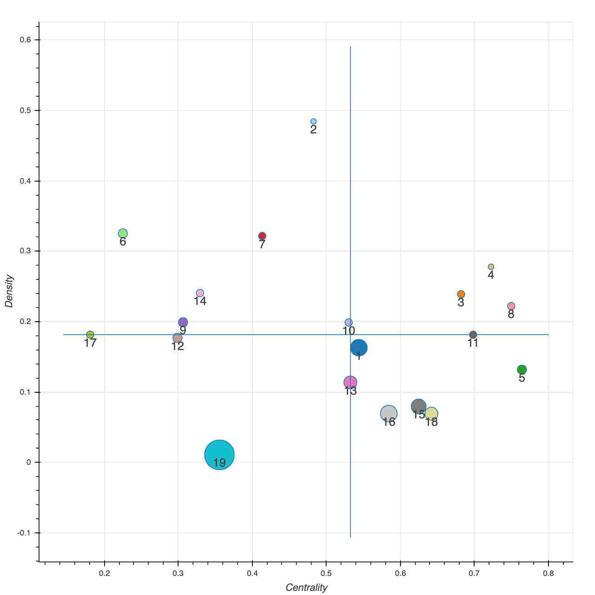
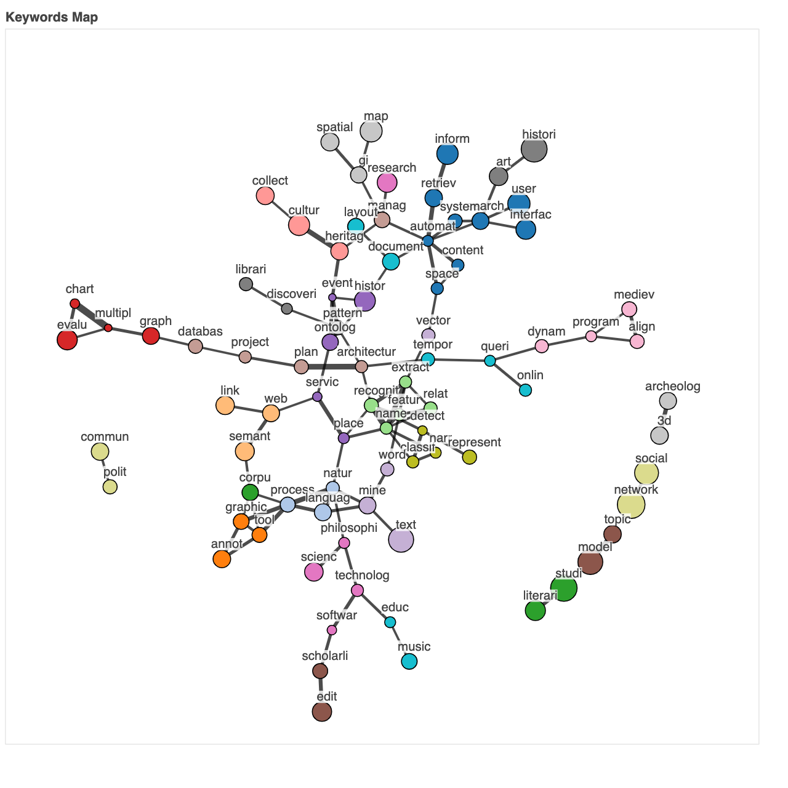

# vis4dh-keywords
Compation materials for the paper "A Data-Driven Introduction to Authors, Readings and Techniques in Visualization for the Digital Humanities" (to appear in IEEE Computer Graphics & Applications).

In order to replicate our paper you need to get your hands on the VIS4DH dataset we curated [here](https://docs.google.com/spreadsheets/d/1TCnEIfbyow7s7_qnl_KZs4cUZjrt4bpz5C8VJLe-XIA/edit?usp=sharing)
Just add the dataset, make the Jupyter notebook use it and voilá. It will take you to the different data analysis tecniques I applied using mainly sklearn, nltk, bokeh and networkx. 

In the end, the notebook produces a [strategic diagram](http://ubicomp.oulu.fi/analysis-of-the-chi-research-communitys-knowledge-map/) and an associated keywords network (see below).

